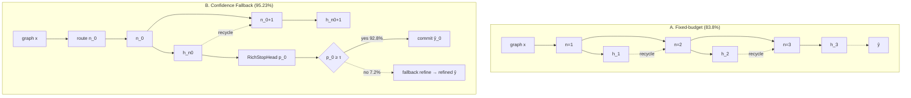

# Figure 1 自绘说明 — Confidence Fallback Inference Controller

供 Figma / PowerPoint / Illustrator / draw.io 等工具手工绘制。TikZ 多次迭代箭头对齐仍不稳定，可按本文档自行出图。

---

## 图的整体结构

- **两栏并排**：左 Panel A（灰底），右 Panel B（浅青底）
- **左侧四层水平虚线引导**（两 panel 共用）：
  1. prediction $\hat{y}$（最上）
  2. hidden $h_n$
  3. latent step $n$
  4. graph input $x$（最下）
- **不要**加 “Coconut LLM” 横线/标签（会与竖向箭头重叠）

---

## Panel A — Fixed-budget baseline

### 标题与标注
| 位置 | 文字 |
|------|------|
| 左上标题 | **A. Fixed-budget baseline** |
| 副标题 | Uniform $n=3$ · **83.8%** |
| 左下脚注 | No structure routing · depth mismatch on mixed-hop graphs |

### 节点（按层排列，三列 latent / hidden 对齐）

| 层 | 列1 | 列2 | 列3 | 右侧 |
|----|-----|-----|-----|------|
| graph input | 三个小圆点 + 标签 `graph x` | — | — | — |
| latent step $n$ | 橙框 `$n=1$` | 橙框 `$n=2$` | 橙框 `$n=3$` | — |
| hidden $h_n$ | 紫框 `$h_1$` | 紫框 `$h_2$` | 紫框 `$h_3$` | — |
| prediction | — | — | — | 灰框 `$\hat{y}$` |

### 颜色
- 橙框（latent）：填充 `#FFB778` 40%，边框 `#FFB778`
- 紫框（hidden）：填充 `#D2B9E6` 55%，边框 `#8E7CC3`
- 预测框：浅灰填充，深灰边框

### 箭头（全部直角折线，**从框边到框边**，不可穿过框内文字）

```
graph x ──→ n=1                    (从 graph 右侧 → n=1 左缘)
n=1 ↑ h_1                          (n=1 上缘 → h_1 下缘)
n=2 ↑ h_2
n=3 ↑ h_3
h_1 ──↓──→ n=2                     (从 h_1 右缘，经列间通道向下到 n=2 左缘；标注 recycle)
h_2 ──↓──→ n=3                     (同上，到 n=3)
h_3 ──→ ŷ                          (从 h_3 右缘，向上到 ŷ 下缘；**虚线**表示 decode/readout)
```

**Recycle 走线要点**：在列 1 与列 2 **之间的空白通道**向下，再水平进入下一列 `n` 的**左边缘**，不要从 `n=2`、`n=3` 方块中心竖穿下去。

---

## Panel B — Confidence Fallback (ours)

### 标题与标注
| 位置 | 文字 |
|------|------|
| 左上标题 | **B. Confidence Fallback (ours)** |
| 副标题1 | Route-then-gate · **95.23%** · fixed weights |
| 副标题2（青色） | Gate commit vs. fallback ($\tau=0.48$) |

### Latent 主链路节点

| 层 | 内容 |
|----|------|
| graph input | 三个小圆点 + `graph x` |
| graph input 旁 | 青框 **route $n_0$**（BFS 深度路由） |
| latent | 橙框 `$n_0$` → 橙框 `$n_0+1$` |
| hidden | 紫框 `$h_{n_0}$` → 紫框 `$h_{n_0+1}$` |

### Latent 主链路箭头

```
graph x ──→ route n_0 ──→ n_0        (水平 + 经左侧通道进入 n_0 左缘)
n_0 ↑ h_{n_0}
n_0+1 ↑ h_{n_0+1}
h_{n_0} ──↓──→ n_0+1                 (recycle，列间通道，标注 recycle)
h_{n_0} ──→ [CF controller]          (进入右侧控制器 RichStopHead 左缘；走上方通道，勿穿过 h_{n_0+1})
```

---

## CF controller 小框（Panel B 右侧）

### 外框
- 圆角矩形，浅青边框 + 极浅青填充
- 左上角框内标签：**CF controller**（不要压在节点上）

### 内部节点（上排一行 + 下方 fallback）

```
[RichStopHead p_0]  →  ◇ p_0≥τ  →  [commit ŷ_0]
                           │
                           ↓ (虚线)
                    [fallback refine → refined ŷ]
```

| 节点 | 样式 | 文字 |
|------|------|------|
| RichStopHead | 珊瑚/粉边框矩形 | RichStopHead $p_0$ |
| Gate | 菱形 | $p_0 \ge \tau$ |
| Commit | 青边框矩形 | commit $\hat{y}_0$ |
| Fallback | **虚线**紫边框矩形 | fallback refine → refined $\hat{y}$ |

### 控制器内箭头与标注

| 从 | 到 | 线型 | 标注 |
|----|-----|------|------|
| RichStopHead 右缘 | 菱形左缘 | 实线 | — |
| 菱形右缘 | commit 左缘 | 实线 | **yes 92.8%**（标在箭头上方） |
| 菱形下缘 | fallback 上缘 | **虚线** | **no 7.2%**（标在箭头右侧） |

**要点**：
- 所有箭头止于边框，不进入框内
- 菱形与 RichStopHead、commit 之间留足水平间距
- fallback 居中放在菱形正下方

---

## 数值一览（须与正文一致）

| 指标 | 值 |
|------|-----|
| Panel A 准确率 | 83.8% |
| Panel B (CF) 准确率 | 95.23% |
| 阈值 $\tau$ | 0.48 |
| Commit 比例 | 92.8% (yes) |
| Fallback 比例 | 7.2% (no) |
| Fixed budget | $n=3$ uniform |
| CF 平均步数（正文） | $\bar{n}=3.51$（图内可不写，caption 可提） |

---

## Figure Caption（英文，可直接粘贴）

> **Confidence Fallback inference controller (Coconut-style).** **A**, Fixed-budget inference with three uniform latent steps and hidden-state recycling (83.8%). **B**, CF routes $n_0$ from BFS depth, recycles hidden states, scores $p_0$ with RichStopHead $g$, commits when $p_0\ge\tau$ (92.8%), and triggers fallback refinement on the 7.2% low-confidence tail. Tiny graph icons: nodes (circles) in input $x$ (directed edges omitted for clarity).

---

## Mermaid 逻辑参考（仅表意，非最终版式）



---

## 绘制检查清单

- [ ] 所有箭头：**边缘 → 边缘**，不穿过节点内部
- [ ] Recycle 走**列间空白**，不竖穿 $n=2$、$n_0$ 等橙框
- [ ] $h_3 \to \hat{y}$ 用虚线，从 $h_3$ 右侧经通道到 $\hat{y}$ **底边**
- [ ] CF controller 外框完整包住四个内部节点
- [ ] 无 Coconut LLM 标签
- [ ] graph $x$ 仅三圆点，无内部乱箭头
- [ ] yes/no 百分比不压在菱形或箭头上

---

## 导出建议

- 宽度：论文 `\linewidth`（双栏 figure* 或单栏 full width）
- 格式：PDF 矢量或 300dpi PNG
- 替换路径：`submission_en/figures/figure1_flow.tex` → 改为 `\includegraphics{figure1.pdf}` 或在 Overleaf 上传你的图

如需我帮你把 tex 改成 `\includegraphics` 占位版本，说一声即可。
